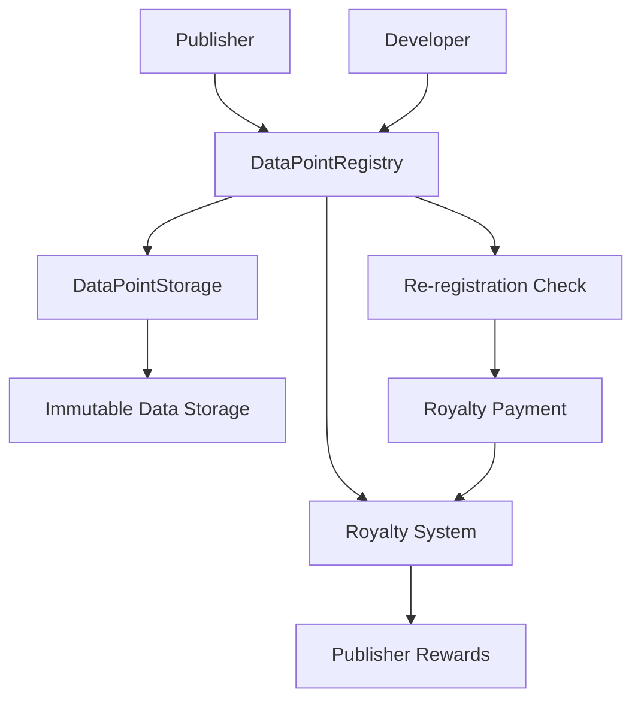

# Ethereum Storage Proocol (ESP) Overview

The Ethereum Storage Protocol (ESP) is a decentralized storage system built on Ethereum that provides immutable, content-addressed data storage with built-in economic incentives for data publishers.

## What is ESP?

ESP is a two-layer protocol that combines:

1. **DataPointStorage** - A core storage layer providing immutable, collision-resistant data storage
2. **DataPointRegistry** - An economic layer managing royalties, publisher incentives, and access control

## Key Features

### 🔒 Immutable Storage
- Content-addressed storage prevents data tampering
- Data integrity is guaranteed through cryptographic hashing
- Once stored, data cannot be modified or deleted

### 💰 Economic Incentives
- Publishers earn royalties when developers re-register the same data on-chain
- Self-sustaining economic model encourages data quality and prevents duplication
- Fair compensation for data creators who save others from uploading duplicate content

### ⚡ Gas Optimized
- 31.6% gas efficiency improvement over baseline implementations
- Optimized for cost-effective data storage and retrieval
- Efficient royalty calculation and distribution

### 📏 Data Size Limits
- **Recommended maximum**: 32KB per data point
- **Absolute maximum**: ~42KB (tested limit)
- For larger data, build custom smart contracts that chunk data into ESP-compatible sizes

### 🛡️ Security Hardened
- Comprehensive reentrancy protection
- Access controls and ownership management
- Battle-tested security patterns

### 🔧 Modular Design
- Upgradeable registry with persistent storage layer
- Clean separation of concerns
- Easy integration with existing applications

## How ESP Works



### Basic Flow

1. **Data Submission**: Publishers submit data to the DataPointRegistry
2. **Storage**: Data is stored in DataPointStorage with a unique content-addressed identifier
3. **Registration**: Data point is registered with publisher information for royalty tracking
4. **Re-registration**: When developers want to use the same data, they pay royalties to the original publisher
5. **Rewards**: Publishers can withdraw their earned royalties

## Core Concepts

### Data Points
Data points are the fundamental unit of storage in ESP. Each data point:
- Has a unique content-addressed identifier
- Is immutable once stored
- Can be associated with a publisher for royalty collection

### Content Addressing
Data is addressed by its content using cryptographic hashing:
- Same data always produces the same address
- Different data produces different addresses
- Prevents data duplication and ensures integrity

### Royalty System
The royalty system provides economic incentives:
- Publishers earn royalties when developers re-register the same data on-chain
- Royalty rates are configurable by the protocol owner
- Royalties are calculated based on gas usage during initial storage

## Use Cases

### Decentralized Applications (DApps)
- Store application state and configuration data
- Share data between different applications
- Create immutable data references

### Content Publishing
- Publish articles, media, or other content
- Earn royalties when others re-register the same content
- Maintain content integrity and provenance

### Data Marketplaces
- Create data marketplaces with built-in payment systems
- Enable data monetization for creators
- Provide transparent royalty distribution

### Archival Systems
- Store important historical data
- Create permanent records
- Ensure long-term data availability

## Getting Started

### Installation
```bash
npm install ethereum-storage
# or
npm install @tw3/esp
```

### Basic Usage
```typescript
import { 
  DataPointRegistry__factory, 
  DataPointStorage__factory,
  getContractAddress,
  loadContract 
} from 'ethereum-storage';

// Connect to deployed contracts
const provider = new ethers.JsonRpcProvider('YOUR_RPC_URL');
const signer = new ethers.Wallet('YOUR_PRIVATE_KEY', provider);

// Load contracts
const dataPointRegistry = loadContract(11155111, 'dpr', signer); // Sepolia
const dataPointStorage = loadContract(11155111, 'dps', signer);

// Store data with royalties
const data = ethers.toUtf8Bytes("Hello, ESP!");
const tx = await dataPointRegistry.registerDataPoint(data, signer.address);
await tx.wait();
```

## Architecture Benefits

### Decentralization
- No single point of failure
- Distributed across Ethereum network
- Censorship-resistant storage

### Economic Sustainability
- Self-sustaining through royalty payments
- Incentivizes data quality and availability
- Fair compensation for data creators

### Interoperability
- Standard interfaces for easy integration
- Compatible with existing Ethereum tooling
- Works with any EVM-compatible network

## Security Considerations

### Immutability
- Data cannot be modified once stored
- Content addressing prevents tampering
- Cryptographic integrity guarantees

### Access Control
- Publisher ownership can be transferred
- Royalty collection requires proper authorization
- Owner controls protocol parameters

### Economic Security
- Royalty rates are set by trusted owners
- Gas-based royalty calculation prevents manipulation
- Reentrancy protection prevents attacks

## Next Steps

- [Learn about Data Points](/docs/esp/datapoints)
- [Understand Storage Layer](/docs/esp/esp-storage)
- [Explore Registry Operations](/docs/esp/registry)
- [Master Royalty System](/docs/esp/royalties)

## Support

For questions, issues, or contributions:
- GitHub: [ethereum-storage-protocol](https://github.com/TechnicallyWeb3/ethereum-storage-protocol)
- Issues: [Report bugs or request features](https://github.com/TechnicallyWeb3/ethereum-storage-protocol/issues)
- Documentation: [Full API reference](https://github.com/TechnicallyWeb3/ethereum-storage-protocol/blob/main/README.md)
